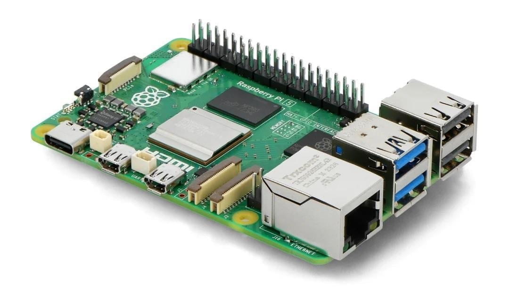
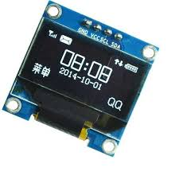
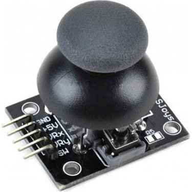
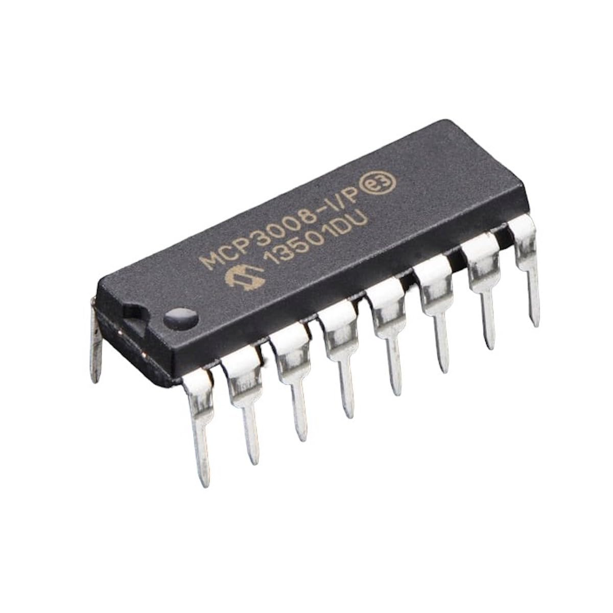
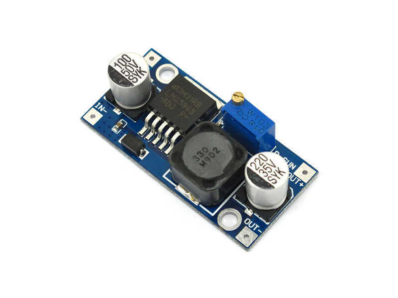
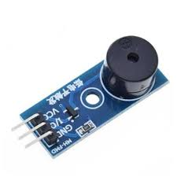
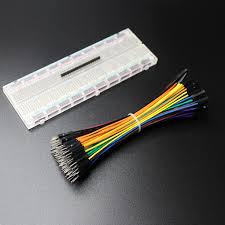

# 💣 BomberPi - Raspberry Pi 5 Arcade Game

BomberPi, Raspberry Pi 5 üzerinde Python ve GPIO pinleri kullanılarak geliştirilmiş, OLED ekranlı, sesli ve ışıklı bir arcade oyunudur.

## 🎮 Özellikler
* **OLED Ekran (SSD1306):** Oyun sahası ve grafikler.
* **Analog Joystick (MCP3008):** Karakter kontrolü (8 Yönlü).
* **RGB LED:** Bomba durumu ve patlama efektleri.
* **Pasif Buzzer:** Arka plan müziği ve ses efektleri (Threading yapısı ile).
* **Skor Sistemi:** 60 saniyelik zaman yarışı.

## 🛠️ Donanım Listesi

| Bileşen | Görsel | Açıklama |
| :--- | :---: | :--- |
| **Raspberry Pi 5** |  | Projenin beyni. (Pi 3/4 de olur). |
| **OLED Ekran** |  | 0.96" I2C SSD1306 Ekran. Oyun sahası. |
| **Analog Joystick** |  | Karakter kontrolü için. |
| **MCP3008** |  | Analog veriyi dijitale çeviren ADC çipi. |
| **RGB LED** |  | Durum bildirimleri ve patlama efekti. |
| **Pasif Buzzer** |  | Ses efektleri ve müzik modülü. |
| **Breadboard** |  | Devre kurulumu için. |

## 🔌 Bağlantı Şeması (Pinout)

| Bileşen | Pin | Raspberry Pi GPIO |
| :--- | :--- | :--- |
| **OLED SDA** | SDA | GPIO 2 (Pin 3) |
| **OLED SCL** | SCL | GPIO 3 (Pin 5) |
| **Joystick Buton** | SW | GPIO 17 (Pin 11) |
| **Buzzer** | Sinyal | GPIO 27 (Pin 13) |
| **RGB Kırmızı** | R | GPIO 22 (Pin 15) |
| **RGB Yeşil** | G | GPIO 23 (Pin 16) |
| **RGB Mavi** | B | GPIO 25 (Pin 22) |
| **MCP3008** | SPI | SPI0 (GPIO 8, 9, 10, 11) |

## 🚀 Kurulum ve Çalıştırma

1. Projeyi klonlayın:
```bash
git clone [https://github.com/aliapaydin/BomberPi_Game.git](https://github.com/aliapaydin/BomberPi_Game.git)
cd BomberPi

2. Sanal ortamı kurun ve kütüphaneleri yükleyin:

```bash
python3 -m venv .venv
source .venv/bin/activate
pip install adafruit-circuitpython-ssd1306 adafruit-circuitpython-mcp3xxx pillow gpiozero rpi-lgpio

3. Oyunu başlatın:

```bash
python3 bomberpi.py

👨‍💻 Geliştirici
Geliştirildi: Ali APAYDIN
